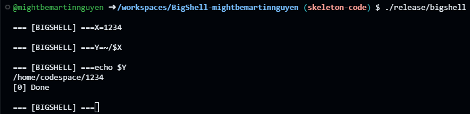

## Overview

BigShell is a POSIX-like shell program that demonstrates important process concepts. This project involves parsing command-line input, executing commands, implementing built-in commands, performing I/O redirection, managing shell variables, handling signals, and implementing job control.

## PLEASE NOTE
With OSU Student Conduct guidelines I will have to keep the code in a private Github Rep. 

## Features

- **Command Parsing**: Parse command-line input into executable commands.
- **External Commands**: Execute a variety of external commands as separate processes.
- **Built-in Commands**: Implement built-in shell commands like `cd`, `exit`, and `unset`.
- **I/O Redirection**: Perform various I/O redirection operations.
- **Shell Variables**: Assign, evaluate, and export shell variables.
- **Signal Handling**: Implement appropriate signal handling for the shell and executed commands.
- **Job Control**: Manage processes and pipelines using job control concepts.

## Screenshots

### Built-in Commands
Does the exit built-in work appropriately? 

Does the cd built-in work appropriately? 

If the HOME variable is modified, does the cd utility respond appropriately?

Does the unset built-in work appropriately? 

### Parameters and Variables
If a variable is set with no command words, does it persist as an internal (not exported) shell variable?

If a variable is exported with the export utility, does a child process that is executed have that variable set in its environment? 

If a variable is set as part of a command, does the child process that is executed have that variable set in its environment (and only its environment)?

If a foreground command is executed, does the $? special parameter get updated appropriately? 

If a background command is executed, does the $! special parameter get updated appropriately? 

If a foreground command is executed, does it not modify $!?

If the PATH variable is changed, does it affect command lookup?

Does the cd built-in update the PWD shell variable?

### Word Expansions 
Are command words expanded properly?

Are assignment values expanded properly?

Are redirection filenames expanded properly?

###Redirection
- Note Each of the tests shown in this section assume that the file(s) being redirected do not initially exist.

> operator creates a new file, and doesn’t overwrite existing file?

>| operator creates a new file, and does overwrite existing file?

< operator works appropriately?

<> operator works appropriately?

>> operator works appropriately

>& operator works appropriately?

Multiple redirections work appropriately?

## Learning Outcomes

- Describe and use the Unix process API.
- Write programs using the Unix API for signal handling and I/O redirection.
- Understand and implement job control and process management in a shell.

## Built-in Shell Utilities

- `cd`: Change the working directory.
- `exit`: Exit the shell.
- `unset`: Unset values of variables.

## Command Execution and Expansion

- **Command Words**: Expand command words.
- **Assignment Values**: Expand assignment values.
- **Redirection Filenames**: Expand redirection filename operands.

## I/O Redirection Operators

- `>`: Redirect output.
- `<`: Redirect input.
- `<>`: Open for reading and writing.
- `>>`: Append output.
- `>|`: Force output.
- `>&`: Duplicate output file descriptor.
- `<&`: Duplicate input file descriptor.

## Simple Commands

- **Foreground Commands**: Execute commands sequentially using `;`.
- **Background Commands**: Execute commands in the background using `&`.
- **Pipelines**: Execute commands in a pipeline using `|`.

## Job Control

- Manage and control jobs, including starting, stopping, and resuming jobs.

## Reference Documents

- **Builtins**: `cd(1)`, `chdir(3)`, `exit(1)`, `strtol(3)`, `unset(1)`, `getenv(3)`, `setenv(3)`.
- **Signal Handling**: `sigaction(3)`, `kill(2)`, `signal.h(0)`, `signal(7)`.
- **I/O Redirection**: `dup(2)`, `fcntl(3)`, `open(2)`.
- **Foreground/Background Commands**: `wait(2)`.
- **Pipelines**: `pipe(2)`.
- **Job Control**: `isatty(3)`, `setpgid(3)`, `getpgid(3)`, `tcsetpgrp(3)`, `tcgetpgrp(3)`.
- **General Purpose**: `ctype.h(0)`, `errno.h(0)`.

## Specifications

- Implement the BigShell command language, including quoting, token recognition, parameters, word expansions, redirection, and signal handling.
- Ensure robust error handling and user-friendly messages.

## Credits
Skeleton Code provided by Ryan Gambord, with Martin Nguyen implementing the 
- Built-in Commands

- Non-built-in commands

- Foreground/Background process waiting

- Redirection

- Pipelines

- Variable Assignment

- Signal Handling

- Job Control Functionality
